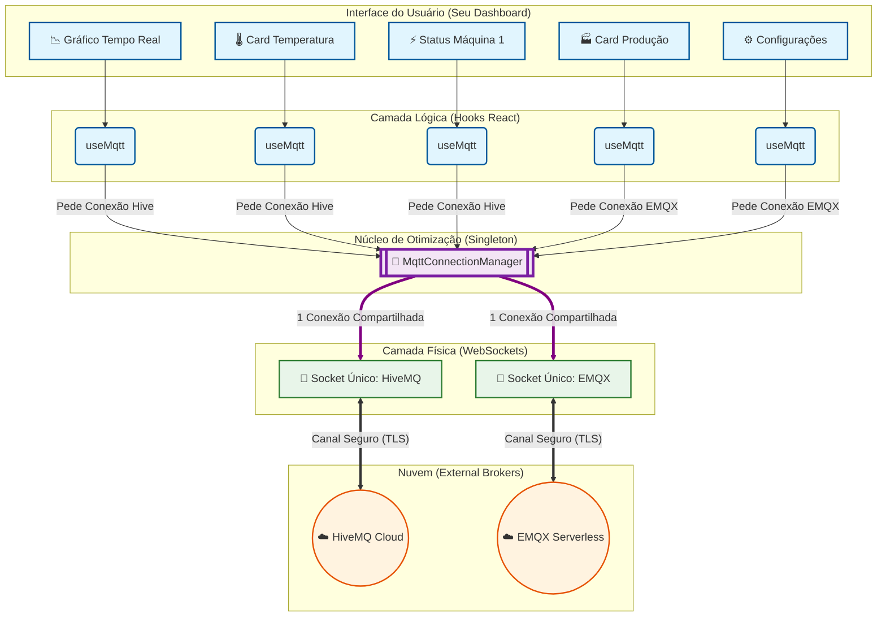

# Arquitetura de Conexões MQTT Otimizada

Este diagrama ilustra como o `MqttConnectionManager` (Singleton) atua como um "porteiro inteligente", permitindo que dezenas de componentes na interface consumam dados em tempo real utilizando o mínimo absoluto de conexões físicas (WebSockets) com os Brokers externos.

## Pontos Chave:

1.  **Escalabilidade no Frontend**: Você pode ter 100 componentes na tela (Cards, Gráficos, Tabelas).
2.  **Eficiência de Rede**: Apenas **2 conexões reais** (uma para cada Broker distinto) são abertas.
3.  **Economia de Recursos**: O navegador economiza memória e o Broker não bloqueia sua conta por excesso de clientes.
4.  **Resiliência**: Se um componente falha, a conexão principal continua viva para os outros.
