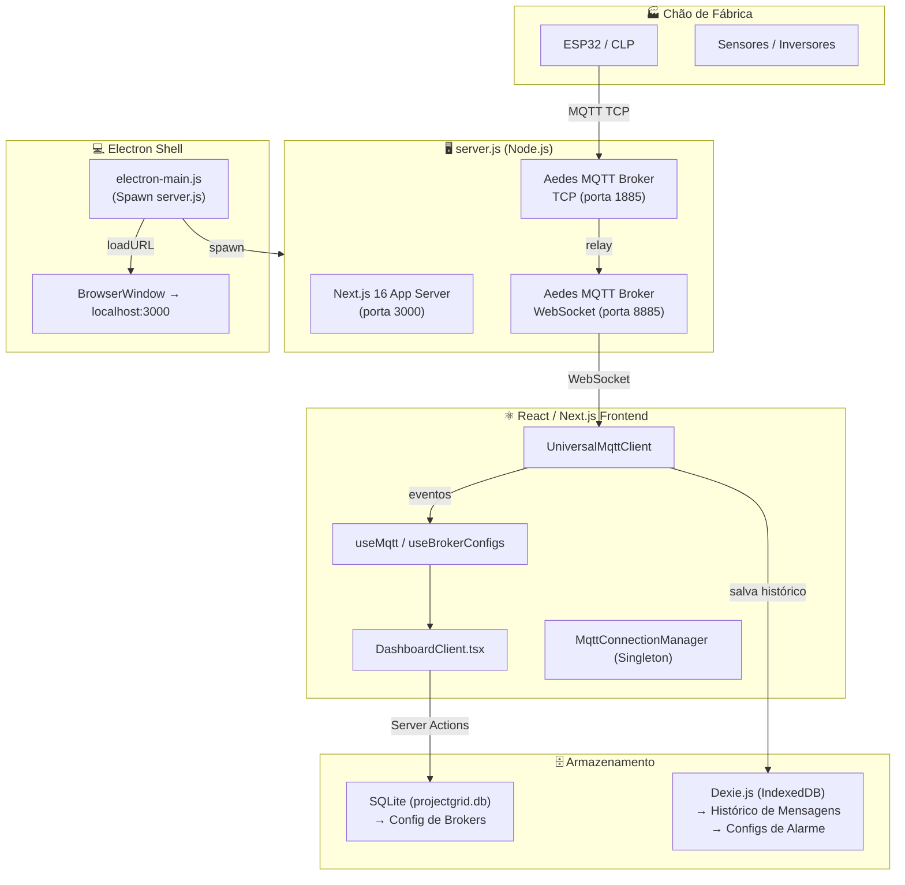

# 📊 Relatório Técnico & de Negócio — ProjectGrid IoT

> **Data do Relatório:** 19 de Março de 2026  
> **Autor da Análise:** Antigravity AI  
> **Repositório:** [github.com/Lucivansant/ProjectGrid_IoT](https://github.com/Lucivansant/ProjectGrid_IoT)  
> **Status:** Em Desenvolvimento Ativo

---

## 1. 🎯 Visão Geral da Ideia de Negócio

O **ProjectGrid IoT** é uma plataforma de **monitoramento industrial** que resolve um problema real e caro no mercado B2B: a dificuldade de pequenas e médias indústrias em adotar soluções de telemetria industrial sem pagar por infraestruturas de nuvem caras e complexas.

### Proposta de Valor Central

| Dor do Cliente | Solução ProjectGrid |
|---|---|
| Software industrial é caro (licenças anuais de R$ 10k+) | Versão desktop gratuita (open source) |
| Soluções cloud exigem internet estável na fábrica | MQTT Broker embutido — funciona offline |
| Times técnicos pequenos, difícil de configurar | Interface web moderna, sem necessidade de sysadmin |
| Dados sensíveis saindo para nuvem de terceiros | Dados salvos localmente (SQLite + Dexie.js) |

### Modelo de Negócio (Hipotético / Em Construção)

```
┌───────────────────────────────────────────────────┐
│  CAMADA GRATUITA (Open Source / Electron Desktop) │
│  • Broker MQTT interno                            │
│  • Dashboard em tempo real                        │
│  • Histórico local (SQLite + Dexie)               │
│  • Alarmes e alertas básicos                      │
└───────────────────┬───────────────────────────────┘
                    │ Upsell / Conversão
┌───────────────────▼───────────────────────────────┐
│  CAMADA PREMIUM (VPS / Cloud SaaS)                │
│  • Monitoramento 24/7 sem necessidade de PC ligado│
│  • Análise preditiva (picos de corrente, RPM)     │
│  • Alertas via Telegram/WhatsApp                  │
│  • Relatórios históricos (até 1 ano)              │
│  • Multi-usuário / Multi-planta                   │
└───────────────────────────────────────────────────┘
```

### Mercado-Alvo

- **Indústria têxtil, alimentícia e metalúrgica** (PMEs)
- **Integradores de automação** que precisam de uma interface rápida para CLPs e Inversores
- **Manutenção preditiva** via monitoramento de motores (corrente, RPM, temperatura)
- **Estufa / Agronegócio** (controle de temperatura, umidade)

> [!NOTE]
> O projeto já tem um posicionamento claro: *"Transformando dados industriais em lucro e eficiência."* Esse é o gancho certo para o mercado industrial brasileiro.

---

## 2. 🏗️ Arquitetura Técnica

### Diagrama de Arquitetura



### Stack Tecnológico Completo

| Camada | Tecnologia | Versão | Papel |
|---|---|---|---|
| Frontend | Next.js (App Router) | 16.1.6 | Interface e Server Actions |
| UI | React | 19.2.3 | Componentes reativos |
| Estilo | Tailwind CSS | v4 | Design System |
| Desktop | Electron | 41.0.2 | Wrapper nativo Windows |
| Broker MQTT | Aedes | 0.51.3 | Broker local TCP + WS |
| Cliente MQTT | mqtt.js | 5.15.0 | Conexão ao broker |
| DB Config | SQLite + sqlite3 | 5.1.1 / 6.0.1 | Configurações persistentes |
| DB Histórico | Dexie.js (IndexedDB) | 4.3.0 | Mensagens e alarmes |
| Gráficos | Recharts | 3.7.0 | Visualização de séries temporais |
| Ícones | Lucide React | 0.563.0 | Iconografia |
| Performance | react-window | 2.2.6 | Virtualização de listas |
| Tipagem | TypeScript | 5.x | Segurança de tipos |

---

## 3. 🗂️ Mapeamento Detalhado do Código

### 3.1 Ponto de Entrada — [server.js](file:///c:/Users/Lucivan/Desktop/IoT%20Project/ProjectGrid_IoT/server.js)

O coração do sistema. Um servidor Node.js customizado que **não usa `next start`**, mas sim inicializa manualmente o Next.js e o Aedes na mesma instância:

```
server.js
├── Next.js HTTP Server         → porta 3000
├── Aedes Broker TCP            → porta 1885 (ESP32, Arduino, hardware)
└── Aedes Broker WebSocket      → porta 8885 (browser, frontend React)
```

> [!TIP]
> Essa abordagem de "tudo em um processo" é inteligente para o Electron: um único `node server.js` levanta toda a infraestrutura.

### 3.2 Wrapper Desktop — [electron-main.js](file:///c:/Users/Lucivan/Desktop/IoT%20Project/ProjectGrid_IoT/electron-main.js)

Responsável por:
1. **Spawnar o [server.js](file:///c:/Users/Lucivan/Desktop/IoT%20Project/ProjectGrid_IoT/server.js)** como processo filho
2. **Aguardar 5 segundos** (timeout fixo) e abrir o `BrowserWindow`
3. **Matar o servidor** quando a janela for fechada (evita portas presas)

> [!WARNING]
> O timeout fixo de 5 segundos para aguardar o servidor subir é um ponto frágil. Em máquinas lentas, o app pode abrir antes do servidor estar pronto. Uma verificação de porta (`waitOn`) seria mais robusto.

### 3.3 Camada de Dados — `_lib/`

#### 📁 [db/LocalDatabase.ts](file:///c:/Users/Lucivan/Desktop/IoT%20Project/ProjectGrid_IoT/app/%28Interno%29/_lib/db/LocalDatabase.ts) — Dexie (IndexedDB)

Gerencia o banco de dados **local do browser** (IndexedDB via Dexie.js):

| Tabela | Chave | Dados |
|---|---|---|
| `messages` | `++id` (auto) | Histórico de todas as mensagens MQTT |
| `device_configs` | `&topic` (único) | Configurações de alarme por dispositivo |

Índices compostos `[brokerId+topic]` para buscas eficientes no histórico.

#### 📁 [actions/brokerActions.ts](file:///c:/Users/Lucivan/Desktop/IoT%20Project/ProjectGrid_IoT/app/%28Interno%29/_lib/actions/brokerActions.ts) — SQLite (Server Actions)

Gerencia a configuração de brokers MQTT no **banco SQLite do servidor**:

| Função | Papel |
|---|---|
| [fetchBrokersServer()](file:///c:/Users/Lucivan/Desktop/IoT%20Project/ProjectGrid_IoT/app/%28Interno%29/_lib/actions/brokerActions.ts#43-56) | Busca todos os brokers (com credenciais) |
| [fetchBrokersPublic()](file:///c:/Users/Lucivan/Desktop/IoT%20Project/ProjectGrid_IoT/app/%28Interno%29/_lib/actions/brokerActions.ts#57-73) | Busca dados não-sensíveis (sem senha) |
| [getBrokerSecret()](file:///c:/Users/Lucivan/Desktop/IoT%20Project/ProjectGrid_IoT/app/%28Interno%29/_lib/actions/brokerActions.ts#74-87) | Busca credenciais sob demanda (lazy loading de senha) |
| [saveBrokerServer()](file:///c:/Users/Lucivan/Desktop/IoT%20Project/ProjectGrid_IoT/app/%28Interno%29/_lib/actions/brokerActions.ts#88-126) | Cria ou atualiza um broker (upsert) |
| [deleteBrokerServer()](file:///c:/Users/Lucivan/Desktop/IoT%20Project/ProjectGrid_IoT/app/%28Interno%29/_lib/actions/brokerActions.ts#127-137) | Remove um broker |

> [!NOTE]
> O padrão de **segurança por design** está bem implementado: a senha só trafega quando realmente necessária para conectar ([getBrokerSecret](file:///c:/Users/Lucivan/Desktop/IoT%20Project/ProjectGrid_IoT/app/%28Interno%29/_lib/actions/brokerActions.ts#74-87)), nunca exposta na listagem pública.

### 3.4 Serviços MQTT — `_lib/services/`

#### [UniversalMqttClient.ts](file:///c:/Users/Lucivan/Desktop/IoT%20Project/ProjectGrid_IoT/app/%28Interno%29/_lib/services/UniversalMqttClient.ts)

Classe que encapsula o `mqtt.js` com uma API limpa orientada a eventos:

```
UniversalMqttClient
├── connect()           → Abre conexão com opções robustas (keepalive, reconnect)
├── subscribe(topic)    → Assina um tópico
├── publish(topic, msg) → Publica (aceita objeto ou string)
├── disconnect()        → Encerra força bruta
├── onMessage(handler)  → Listener de dados (normaliza JSON ou string raw)
├── onConnectionChange  → Listener de status de conexão
└── onError(handler)    → Listener de erros
```

A normalização de payload é inteligente — aceita tanto o formato aninhado `{sensors: {}, status: {}}` quanto payloads planos.

#### [MqttConnectionManager.ts](file:///c:/Users/Lucivan/Desktop/IoT%20Project/ProjectGrid_IoT/app/%28Interno%29/_lib/services/MqttConnectionManager.ts)

Implementa o padrão **Singleton + Reference Counting**:

```
MqttConnectionManager (Global Singleton)
└── clients: Map<connectionId, UniversalMqttClient>
└── references: Map<connectionId, number>
    ├── getConnection(id, config) → Cria ou reutiliza conexão existente
    └── releaseConnection(id)     → Decrementa. Se refs=0, desconecta.
```

Garante que mesmo que 10 componentes React assinem o mesmo broker, **apenas 1 WebSocket** seja aberto.

### 3.5 Hooks React — `_lib/hooks/`

#### [useMqtt.ts](file:///c:/Users/Lucivan/Desktop/IoT%20Project/ProjectGrid_IoT/app/%28Interno%29/_lib/hooks/useMqtt.ts)

Hook de alto nível que combina [MqttConnectionManager](file:///c:/Users/Lucivan/Desktop/IoT%20Project/ProjectGrid_IoT/app/%28Interno%29/_lib/services/MqttConnectionManager.ts#8-84) + [UniversalMqttClient](file:///c:/Users/Lucivan/Desktop/IoT%20Project/ProjectGrid_IoT/app/%28Interno%29/_lib/services/UniversalMqttClient.ts#21-150):
- Suporte a wildcards `#` e `topic/#`
- Cleanup automático no `useEffect` (libera conexão ao desmontar)
- Expõe `{ isConnected, connectionError, data, publishMessage }`

> [!WARNING]
> **Memory Leak Identificado:** O hook registra handlers com [onMessage](file:///c:/Users/Lucivan/Desktop/IoT%20Project/ProjectGrid_IoT/app/%28Interno%29/_lib/services/UniversalMqttClient.ts#137-141), [onConnectionChange](file:///c:/Users/Lucivan/Desktop/IoT%20Project/ProjectGrid_IoT/app/%28Interno%29/_lib/services/UniversalMqttClient.ts#142-145) e [onError](file:///c:/Users/Lucivan/Desktop/IoT%20Project/ProjectGrid_IoT/app/%28Interno%29/_lib/services/UniversalMqttClient.ts#146-149), mas o [UniversalMqttClient](file:///c:/Users/Lucivan/Desktop/IoT%20Project/ProjectGrid_IoT/app/%28Interno%29/_lib/services/UniversalMqttClient.ts#21-150) não implementa método `off()` para remover listeners. A cada remontagem do componente, handlers antigos acumulam. Isso está documentado nos comentários do próprio código.

#### [useBrokerConfigs.ts](file:///c:/Users/Lucivan/Desktop/IoT%20Project/ProjectGrid_IoT/app/%28Interno%29/_lib/hooks/useBrokerConfigs.ts)

Hook de gerenciamento de estado CRUD para brokers:
- Inicializado com dados do SSR (`initialData`)
- Expõe `{ brokers, loading, error, loadBrokers, saveBroker, deleteBroker }`

### 3.6 Utilitários — `_lib/utils/`

#### [DeviceProcessor.ts](file:///c:/Users/Lucivan/Desktop/IoT%20Project/ProjectGrid_IoT/app/%28Interno%29/_lib/utils/DeviceProcessor.ts)

Classe estática de processamento de dados brutos:

```
DeviceProcessor
├── safeParse(payload)          → String/Object → Record<string, unknown>
├── extractTelemetry(payload)   → Filtra apenas campos numéricos
│                                 Busca em: telemetry, sensors, sensores, data
│                                 Ignora: id, timestamp, ts
├── isDeviceOnline(lastSeen)    → Online se visto há menos de 15s (configurável)
└── getTimestamp(payload)       → Extrai timestamp do payload ou usa fallback
```

### 3.7 Componentes UI — `Dashboard/Components/`

```
DashboardClient.tsx             ← Orquestrador principal
├── Header/Header.tsx           ← Barra superior (usuário, menu mobile)
├── Sidebar/Sidebar.tsx         ← Navegação lateral
├── Stats/
│   ├── StatsGrid.tsx           ← Grid de cards de KPIs
│   └── ReliabilityGauge.tsx    ← Indicador visual de confiabilidade
├── Config/
│   └── broker-config-form.tsx  ← Formulário CRUD de brokers MQTT
├── Discovery/
│   ├── DiscoveryGrid.tsx       ← Grid de dispositivos descobertos
│   ├── DeviceChart.tsx         ← Gráfico de série temporal (Recharts)
│   ├── AlarmWidget.tsx         ← Widget de alarmes ativos
│   └── StorageStatusWidget.tsx ← Status do armazenamento Dexie
├── DataGrid/
│   ├── DevicesTable.tsx        ← Tabela virtualizada de dispositivos
│   ├── DeviceRow.tsx           ← Linha de dispositivo com sparkline
│   ├── DeviceModal.tsx         ← Modal de detalhes do dispositivo
│   ├── AlarmSettings.tsx       ← Configuração de alarmes (min, max, exact)
│   └── Sparkline.tsx           ← Mini gráfico de tendência
├── Console/
│   └── MqttConsole.tsx         ← Console de debug de mensagens raw
└── Widgets/
    └── LiveDataTable.tsx       ← Tabela de dados ao vivo
```

### 3.8 Simulador de Dispositivos — [simulate_device.js](file:///c:/Users/Lucivan/Desktop/IoT%20Project/ProjectGrid_IoT/simulate_device.js)

Script de testes que simula 3 dispositivos industriais distintos:

| Dispositivo | Tópico | Intervalo | Temperatura | Umidade |
|---|---|---|---|---|
| `Estufa_Central` | `projectgrid/estufa` | 3s | 25–30°C | 60–80% |
| `Refrigerador_01` | `projectgrid/refrigerador` | 5s | 2–6°C | 85–95% |
| `Motor_Bomba_X` | `projectgrid/motor` | 1.5s | 60–85°C | 10–20% |

---

## 4. ✅ Pontos Fortes

1. **Arquitetura Híbrida Inteligente** — O mesmo codebase serve tanto como app desktop quanto como serviço web. A separação entre [server.js](file:///c:/Users/Lucivan/Desktop/IoT%20Project/ProjectGrid_IoT/server.js) e [electron-main.js](file:///c:/Users/Lucivan/Desktop/IoT%20Project/ProjectGrid_IoT/electron-main.js) é limpa.

2. **Segurança de Credenciais** — Padrão excelente de separar dados públicos de dados sensíveis dos brokers. [getBrokerSecret](file:///c:/Users/Lucivan/Desktop/IoT%20Project/ProjectGrid_IoT/app/%28Interno%29/_lib/actions/brokerActions.ts#74-87) só é chamado na hora da conexão.

3. **Singleton de Conexões MQTT** — [MqttConnectionManager](file:///c:/Users/Lucivan/Desktop/IoT%20Project/ProjectGrid_IoT/app/%28Interno%29/_lib/services/MqttConnectionManager.ts#8-84) previne abertura de múltiplos WebSockets para o mesmo broker, economizando recursos e prevenindo bugs de duplicação de dados.

4. **Processamento Robusto de Payloads** — [UniversalMqttClient](file:///c:/Users/Lucivan/Desktop/IoT%20Project/ProjectGrid_IoT/app/%28Interno%29/_lib/services/UniversalMqttClient.ts#21-150) e [DeviceProcessor](file:///c:/Users/Lucivan/Desktop/IoT%20Project/ProjectGrid_IoT/app/%28Interno%29/_lib/utils/DeviceProcessor.ts#18-114) aceitam múltiplos formatos de payload sem quebrar.

5. **Dupla Persistência** — SQLite para configurações (requer server restart para mudar) + Dexie.js para histórico high-frequency (browser-native, zero latência de escrita).

6. **Virtualização de Lista** — `react-window` é usado na tabela de dispositivos, preparando para escalar com dezenas/centenas de dispositivos sem degradar performance.

7. **TypeScript Consistente** — Pouquíssimo uso de `any`. Tipos explícitos em quase todas as interfaces públicas.

---

## 5. ⚠️ Pontos de Atenção e Débitos Técnicos

| Prioridade | Problema | Arquivo | Impacto |
|---|---|---|---|
| 🔴 **Alta** | Memory leak de listeners MQTT | [useMqtt.ts](file:///c:/Users/Lucivan/Desktop/IoT%20Project/ProjectGrid_IoT/app/%28Interno%29/_lib/hooks/useMqtt.ts) L85-92 | Degradação de performance com uso prolongado |
| 🔴 **Alta** | Timeout fixo de 5s no Electron | [electron-main.js](file:///c:/Users/Lucivan/Desktop/IoT%20Project/ProjectGrid_IoT/electron-main.js) L52 | Crash silencioso em PCs lentos |
| 🟡 **Média** | `userId` hardcoded como `'demo-user'` | [brokerActions.ts](file:///c:/Users/Lucivan/Desktop/IoT%20Project/ProjectGrid_IoT/app/%28Interno%29/_lib/actions/brokerActions.ts) | Bloqueia evolução para multi-tenant |
| 🟡 **Média** | Sem autenticação real implementada | [DashboardClient.tsx](file:///c:/Users/Lucivan/Desktop/IoT%20Project/ProjectGrid_IoT/app/%28Interno%29/Dashboard/Components/DashboardClient.tsx) L22 | Toda a segurança é apenas estética |
| 🟡 **Média** | Sem limite de tamanho no Dexie | [LocalDatabase.ts](file:///c:/Users/Lucivan/Desktop/IoT%20Project/ProjectGrid_IoT/app/%28Interno%29/_lib/db/LocalDatabase.ts) | Histórico cresce indefinidamente |
| 🟠 **Baixa** | `DEFAULT_CONFIG` aponta para HiveMQ público | [useMqtt.ts](file:///c:/Users/Lucivan/Desktop/IoT%20Project/ProjectGrid_IoT/app/%28Interno%29/_lib/hooks/useMqtt.ts) L6-8 | Dados de teste vazam para broker externo |
| 🟠 **Baixa** | [simulate_device.js](file:///c:/Users/Lucivan/Desktop/IoT%20Project/ProjectGrid_IoT/simulate_device.js) em produção | raiz do projeto | Deveria estar em `/scripts` ou `/dev` |

---

## 6. 🗺️ Roadmap Sugerido

### Fase 1 — Consolidação (Próximas 2–4 semanas)
- [ ] Implementar `off()` no [UniversalMqttClient](file:///c:/Users/Lucivan/Desktop/IoT%20Project/ProjectGrid_IoT/app/%28Interno%29/_lib/services/UniversalMqttClient.ts#21-150) para remover listeners
- [ ] Substituir timeout fixo do Electron por `waitOn` (verificação de porta)
- [ ] Implementar limpeza automática do histórico Dexie (TTL de 30/90/365 dias)
- [ ] Adicionar sistema de login real (JWT ou sessão simples)
- [ ] Adicionar `userId` dinâmico no SQLite (preparar para multi-tenant)

### Fase 2 — Expansão de Features (1–3 meses)
- [ ] Tela de histórico com filtros por data e dispositivo
- [ ] Gráficos históricos (última hora, dia, semana, mês)
- [ ] Exportação de histórico (CSV / PDF / Excel)
- [ ] Cadastro formal de dispositivos (nome, localização, tipo, planta)
- [ ] Status de offline com timestamp: "ficou offline às 14h32"
- [ ] Notificações via Telegram (`node-telegram-bot-api`)
- [ ] Histórico de alarmes disparados com data/hora/valor
- [ ] Acknowledge de alarmes (silenciar / confirmar resolução)

### Fase 3 — Versão Cloud / SaaS (2–4 meses)
- [ ] Autenticação multi-tenant (Clerk.dev ou Auth.js)
- [ ] Deploy em VPS com Docker + docker-compose
- [ ] Banco de dados cloud (PostgreSQL para substituir SQLite)
- [ ] Notificações por e-mail
- [ ] Escalonamento de alertas (não resolvido em X min → notifica supervisor)
- [ ] Billing / Subscription (Stripe)
- [ ] Painel de admin (gerenciar clientes, planos, uso)
- [ ] API REST pública para integração com terceiros
- [ ] Documentação da API (Swagger / OpenAPI)

### Fase 4 — Inteligência e Análise Preditiva (4–8 meses)
- [ ] Baseline automático: aprende o "normal" de cada dispositivo
- [ ] Detecção de tendências (corrente subindo gradualmente = alerta precoce)
- [ ] Score de saúde do equipamento (0–100%)
- [ ] Estimativa de vida útil restante
- [ ] Comparação entre turnos (turno A vs turno B)
- [ ] Relatórios de produtividade (tempo online/offline por período)

---

## 7. 📐 Métricas do Projeto

| Métrica | Valor |
|---|---|
| Arquivos TypeScript/TSX | ~22 |
| Linhas de código estimadas | ~2.500 |
| Dependências de produção | 12 |
| Dependências de desenvolvimento | 10 |
| Banco de dados | 2 (SQLite + IndexedDB) |
| Protocolos suportados | 2 (TCP MQTT + WebSocket) |
| Portas utilizadas | 3 (3000, 1885, 8885) |

---

## 8. 🏢 O Prédio Completo — O que Falta Construir

Uma analogia de construção civil para visualizar o estado atual do produto e o que ainda precisa ser edificado.

### Planta do Prédio

```
┌─────────────────────────────────────────────────────────────┐
│  🏢 COBERTURA  → Cloud SaaS + Billing + Admin              │  ❌ Não existe
├─────────────────────────────────────────────────────────────┤
│  4️⃣  ANDAR    → Análise Preditiva / IA / Score de Saúde   │  ❌ Não existe
├─────────────────────────────────────────────────────────────┤
│  3️⃣  ANDAR    → Notificações & Alertas Proativos           │  ❌ Não existe
├─────────────────────────────────────────────────────────────┤
│  2️⃣  ANDAR    → Histórico, Relatórios & Exportação         │  🔶 20% feito
├─────────────────────────────────────────────────────────────┤
│  1️⃣  ANDAR    → Gestão Formal de Dispositivos              │  🔶 40% feito
├─────────────────────────────────────────────────────────────┤
│  🚪 TÉRREO    → Autenticação & Gestão de Usuários          │  ❌ Não existe
├─────────────────────────────────────────────────────────────┤
│  🪨 FUNDAÇÃO  → MQTT + DB + Core + Dashboard em Tempo Real │  ✅ Sólida
└─────────────────────────────────────────────────────────────┘
```

---

### 🚪 Térreo — Autenticação & Usuários *(Não existe)*

Sem isso o prédio não tem porta. Qualquer um que acesse o endereço entra diretamente no sistema.

```
❌ Login real com sessão (JWT ou Auth.js / Clerk.dev)
❌ userId dinâmico (hoje hardcoded como 'demo-user')
❌ Isolamento de dados por usuário
❌ Registro de novos usuários
❌ Mudança de senha / recuperação de conta
```

> [!CAUTION]
> Sem autenticação real, o sistema **não pode ser lançado para clientes**. Qualquer pessoa com acesso à URL veria os dados de todos os outros usuários.

---

### 1️⃣ 1º Andar — Gestão Formal de Dispositivos *(~40% feito)*

Você já vê os dados chegando, mas não gerencia os dispositivos formalmente.

```
✅ Descoberta automática de dispositivos (DiscoveryGrid)
✅ Status Online/Offline em tempo real (DeviceProcessor.isDeviceOnline)
✅ Configuração de alarmes por variável (AlarmSettings)
❌ Cadastro formal: nome amigável, localização, tipo (motor, sensor, CLP)
❌ Agrupamento por planta / setor
❌ Histórico de status: "ficou offline às 14h32 por 22 minutos"
❌ Configuração de intervalo esperado de envio (heartbeat)
❌ Foto ou QR code do equipamento físico
```

---

### 2️⃣ 2º Andar — Histórico & Relatórios *(~20% feito)*

Os dados chegam e são salvos no Dexie, mas ficam "presos" lá dentro sem forma de consultá-los.

```
✅ Armazenamento de mensagens no Dexie (LocalDatabase.ts)
✅ Índices por topic, brokerId e timestamp para busca rápida
❌ Tela de histórico com filtros (por data, dispositivo, variável)
❌ Gráficos históricos interativos (última hora / dia / semana / mês)
❌ Exportação de dados (CSV, PDF, Excel)
❌ Limpeza automática com TTL configurável (30 / 90 / 365 dias)
❌ Aviso de armazenamento cheio ao usuário
❌ Resumo diário automático (min, max, média por variável)
```

---

### 3️⃣ 3º Andar — Notificações & Alertas Proativos *(Não existe)*

O sistema já **detecta** alarmes (AlarmWidget), mas não faz nada com eles proativamente. O usuário precisa estar olhando o dashboard para saber que algo errou.

```
✅ Configuração de limites de alarme (min / max / exactMatch)
✅ Widget de alarme ativo no dashboard
❌ Histórico de alarmes disparados (data, hora, valor no momento)
❌ Notificação via Telegram quando alarme dispara
❌ Notificação por e-mail
❌ Acknowledge de alarme ("ciente" / silenciar)
❌ Escalonamento: "não resolvido em X minutos → notifica supervisor"
❌ Agrupamento de alarmes (não floodar Telegram com 100 mensagens/min)
```

> [!TIP]
> A **notificação Telegram** é a feature de maior retorno por esforço. Um mecânico recebendo uma mensagem no celular quando o motor superaquece **é o produto em si**, não o dashboard. Implemente isso antes de qualquer coisa no 3º andar.

---

### 4️⃣ 4º Andar — Análise Preditiva *(Não existe — feature premium)*

A razão pela qual alguém **paga mensalidade**. É o diferencial competitivo da camada SaaS.

```
❌ Baseline automático: aprende o "normal" de cada motor/sensor
❌ Detecção de tendências (corrente subindo gradualmente = falha prevista em X dias)
❌ Score de saúde do equipamento (0–100%)
❌ Estimativa de vida útil restante baseada em histórico
❌ Comparação entre turnos (turno A vs turno B — consumo, eficiência)
❌ Relatórios de OEE (Overall Equipment Effectiveness)
```

---

### 🏢 Cobertura — Infraestrutura Cloud / SaaS *(Não existe)*

O que transforma o app local num **negócio recorrente com receita mensal**.

```
❌ Containerização (Docker + docker-compose)
❌ Banco de dados cloud (PostgreSQL)
❌ Sistema de billing / assinatura (Stripe)
❌ Painel de admin (gerenciar clientes, planos, uso de storage)
❌ API REST/WebSocket pública documentada (Swagger)
❌ Multi-tenant completo (dados 100% isolados por empresa)
```

---

### 🎯 Prioridade para o Beta Launch

Se o objetivo é ter uma **versão para mostrar a clientes reais** o quanto antes:

| # | Feature | Andar | Esforço | Impacto |
|---|---|---|---|---|
| 1 | **Autenticação básica** (login + sessão) | Térreo | Médio | 🔴 Crítico |
| 2 | **Notificação Telegram** na disparo de alarme | 3º | Baixo | 🔴 Altíssimo |
| 3 | **Tela de histórico** com filtro de data e gráfico | 2º | Médio | 🟠 Alto |
| 4 | **Exportação CSV** do histórico | 2º | Baixo | 🟠 Alto |
| 5 | **Cadastro formal** de dispositivos (nome + localização) | 1º | Médio | 🟡 Médio |
| 6 | **Histórico de alarmes** disparados | 3º | Baixo | 🟡 Médio |

---

## 9. 💡 Conclusão

O **ProjectGrid IoT** é um projeto com **fundação técnica sólida** e uma **proposta de negócio diferenciada**. A combinação de broker MQTT embutido + armazenamento local resolve de forma elegante a principal barreira de adoção de IoT industrial por PMEs: a dependência de internet e cloud.

O código demonstra maturidade em padrões como Singleton, Server Actions, separação de responsabilidades e tratamento defensivo de dados. Os principais débitos técnicos (memory leak de listeners, autenticação) são resolvíveis e não comprometem a arquitetura central.

Usando a metáfora do prédio: a **fundação está sólida**, mas o prédio ainda não tem porta (autenticação), e quem mora nele não recebe nenhuma notificação quando algo quebra (alertas). Esses dois pontos são o próximo passo óbvio antes de apresentar o produto para qualquer cliente.

> **Potencial comercial:** Alto. O mercado de IIoT (Industrial IoT) no Brasil é estimado em bilhões e carece de soluções acessíveis e que funcionem offline. O modelo freemium (Electron grátis → SaaS premium) é validado por players como ThingsBoard e Grafana.

---

*Relatório gerado em 19/03/2026 e atualizado em 19/03/2026 por análise estática completa do repositório.*
